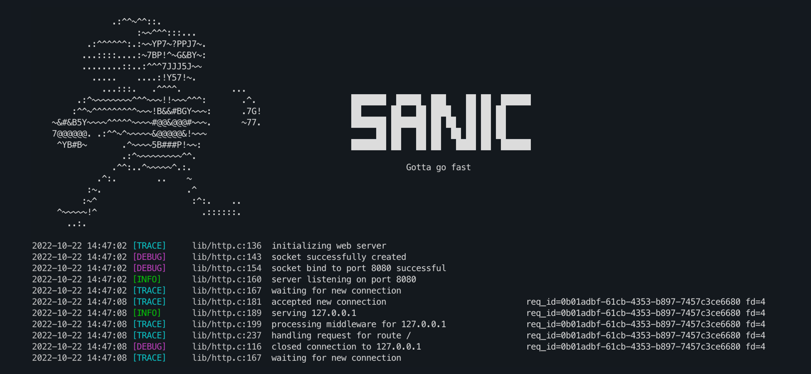

## sanic - Gotta go fast.

Sanic is a simple, small, express-ish HTTP framework built in C. Supports `kqueue` and `epoll`.

### Example - clang blocks

Originally, I built sanic with clang blocks in mind. So they're supported out of the box.

```c
#include <gc.h>
#include <sanic.h>

sanic_init();
sanic_log_level = LEVEL_DEBUG;

sanic_http_on_get("/", ^void(struct sanic_http_request *req) {
  res->response_body = "<h1>Hello, World!</h1>";
});

sanic_http_on_get("/people/{:name}", ^void(struct sanic_http_request *req) {
  char *name = sanic_path_params_get(req, "name");
  //sanic integrates with the Boehm GC to automatically deallocate returned data
  res->response_body = GC_MALLOC_ATOMIC(18 + strlen(name));
  sprintf(res->response_body, "<h1>Hello, %s!</h1>", name);
});

return sanic_http_serve(8080);
```

### Example - function pointers

A less elegant solution is to just pass handler functions as callbacks. With gcc, this can be done in a lambda-ish way,
although I haven't found out how to make cmake understand that.

```c
sanic_init();
sanic_log_level = LEVEL_INFO;

sanic_http_on_get("/", handle_index);
sanic_http_on_get("/people/{:name}", handle_get_person);

return sanic_http_serve(8080);
```

### Middlewares

sanic supports middlewares out of the box. These can either act as filters or as blockers for any request.

```c
sanic_use_middleware(^enum sanic_middleware_action(struct sanic_http_request *req, struct sanic_http_response *res) {
    if (strcmp(req->path, "/foobar") == 0) {
      res->status = 300;
      return ACTION_STOP;
    }
    return ACTION_PASS;
});
```